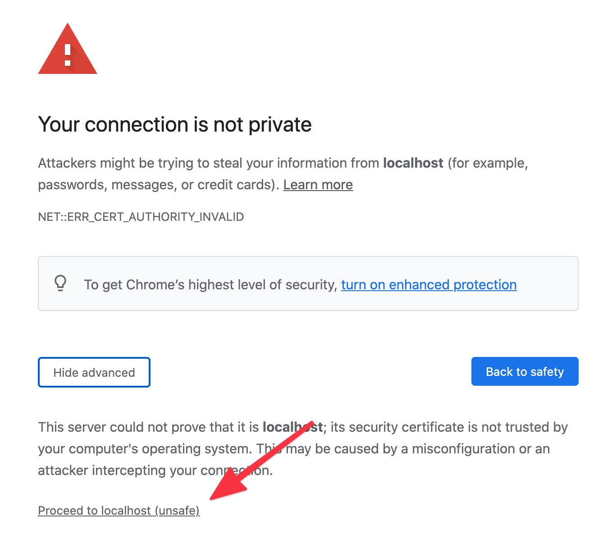

# `fake-https-cert`

> Create fake SSL certificates for `https://localhost` to work.
> Shamelessly stolen from `webpack-dev-server`.

**Before using this, be sure to look at [mkcert](https://github.com/FiloSottile/mkcert)**


## Install

```sh
npm i -D fake-https-cert

yarn add --dev fake-https-cert
```

## Usage

```js
const { createServer } = require("https");
const fakeHttpsCert = require("fake-https-cert");
const fakeCert = getCertificate(console);

const httpsOptions = {
  key: fakeCert,
  cert: fakeCert,
};

createServer(httpsOptions, (req, res) => {
  const urlObj = parse(req.url, true);
  handle(req, res, urlObj);
}).listen(3000, () => {
  console.log("> Server started on https://localhost:3000");
});
```

### Usage with Next.js

Create a `server.js`, run with `node server.js` instead of `yarn dev`.

```js
const { createServer } = require("https");
const next = require("next");
const fakeHttpsCert = require("fake-https-cert");
const dev = process.env.NODE_ENV !== "production";
const app = next({ dev });
const handle = app.getRequestHandler();
const fakeCert = fakeHttpsCert(console);

const httpsOptions = {
  key: fakeCert,
  cert: fakeCert,
};
app.prepare().then(() => {
  createServer(httpsOptions, (req, res) => {
    const url = 'https://' + req.headers.host + req.url;
    const urlObj = new URL(url);
    handle(req, res, urlObj);
  }).listen(3000, () => {
    console.log("> Server started on https://localhost:3000");
  });
});
```

### Browser Support

Welp, browsers don't really like it, but if you enable this certificate manually, they'll forgive you.

<br>


